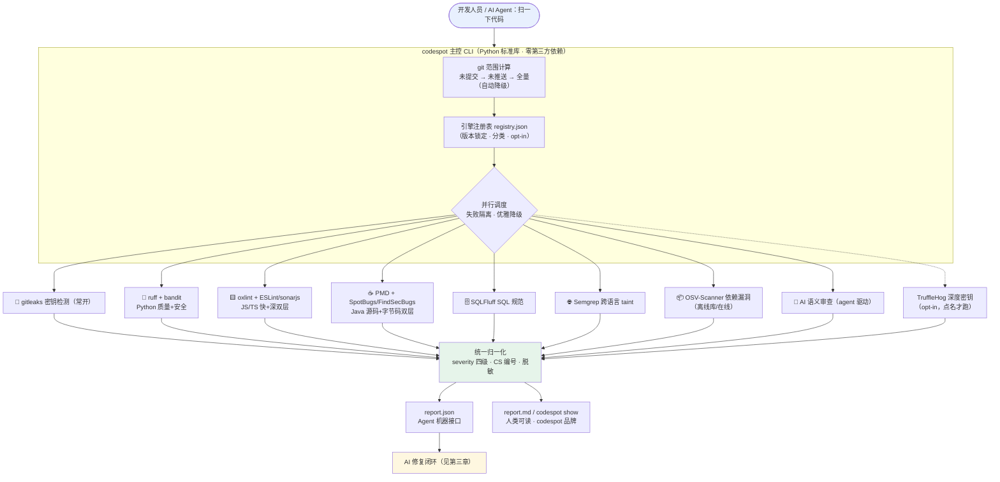
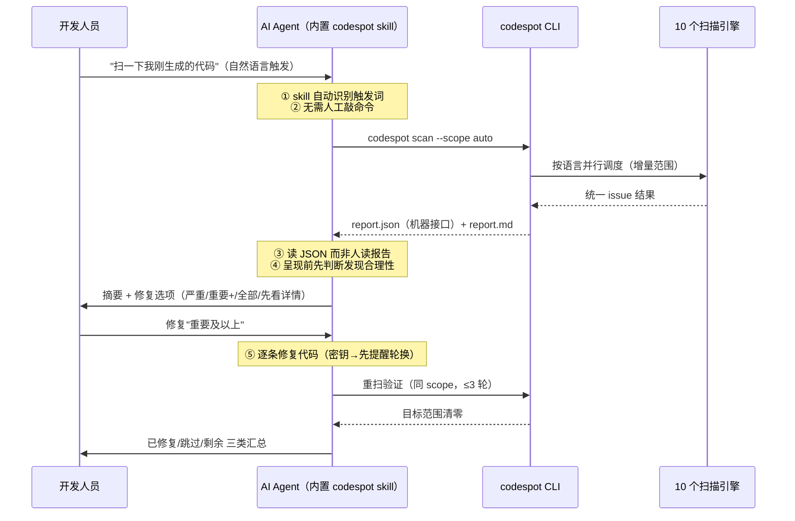
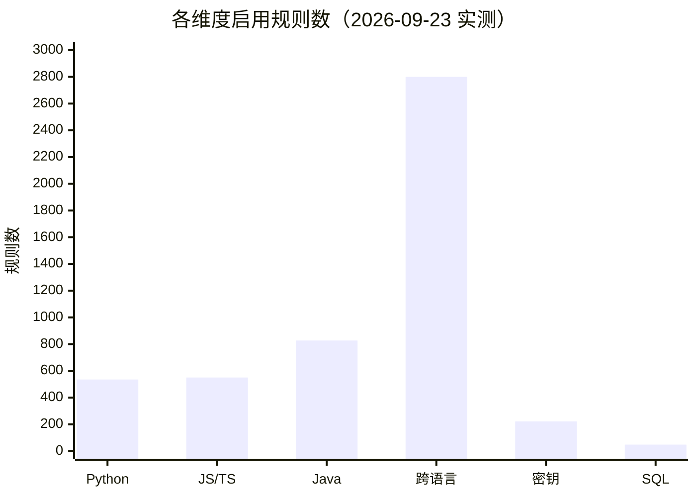
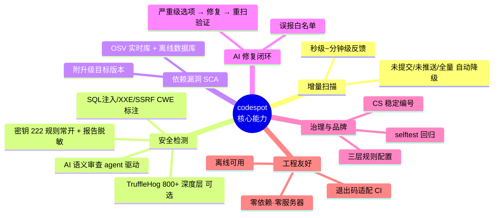

# codespot：面向 AI 编码时代的国产化静态代码扫描工具
## ——项目立项、设计与交付情况汇报

> 汇报日期：2026-09-23 · 项目状态：已交付并投入试用（v1）
>
> 🎨 **演示版**：[project-report.html](project-report.html)（同内容精排图文版，适合投屏汇报）

---

## 一、背景：为什么需要 codespot

### 1.1 AI 编码规模化带来的新风险面

随着 AI 辅助编码（AI Coding）在全行的普及，大量代码由开发人员借助行内外 AI 工具生成。AI 生成的代码在提升效率的同时，引入了三类传统流程难以覆盖的风险：

- **质量风险**：逻辑缺陷、未使用代码、错误处理缺失等问题，人工评审疲劳后难以逐一把关；
- **安全风险**：硬编码密钥、SQL 注入、不安全的随机数与反序列化等漏洞模式出现频率显著偏高；
- **供应链风险**：AI 倾向推荐"能跑就行"的依赖版本，旧版本依赖携带已知 CVE。

### 1.2 现有手段的三个缺口

| 缺口 | 说明 |
|------|------|
| **仅靠 AI 模型扫描不够全面** | 大模型审查非确定性：无规则库兜底、无 CVE 数据库、无密钥特征库，存在漏报与幻觉，且逐文件人工喂模型无法工程化 |
| **传统扫描工具游离于 AI Agent 生态之外** | 商业/开源扫描器（如 SonarQube 系）面向 CI 与服务器架构，必须部署服务端；AI Agent 无法在本地按需调用，更没有"扫描→报告→修复"闭环 |
| **国产化与自主可控要求** | 主流商业扫描工具均为国外产品且许可趋紧（SonarSource 2024 年底将分析器改为非开源 SSALv1，明确限制"用非捆绑 AI 摄取其分析结果"）；核心安全工具依赖外部供应商存在供应链与合规风险 |

### 1.3 项目定位

建设**纯本地运行、完全融入 AI Agent 生态、全栈开源引擎、代码完全自主可控**的静态代码扫描 skill（codespot）：AI 写完代码 → codespot 本地扫描 → 产出 AI 可读报告 → Agent 辅助修复 → 重扫验证，形成完整质量闭环。

---

## 二、解决方案与方案设计

### 2.1 两轮可行性调研（结论先行）

项目启动前完成两轮系统性调研（详见《可行性调研报告》，30+ 组件当日实测核验）：

1. **Sonar 系路线证伪**：官方 CLI 必须连云端/服务器；SSALv1 许可"禁止非捆绑 AI 摄取分析结果"条款与核心场景直接冲突；
2. **采纳路线**：干净许可开源引擎组合（MIT/Apache/LGPL）+ "多引擎适配器 + 统一报告 + AI 修复闭环"架构；
3. **许可合规**：引擎"运行时从官方源下载、不随工具分发"，对 LGPL 零额外义务；Semgrep/TruffleHog 明确"仅内部使用"边界。

### 2.2 总体架构



**关键设计**：适配器统一契约（新增引擎零改基座）；人读界面统一品牌（稳定 CS-xxxxx 编号）；Agent 接口保留完整内部字段保证修复精度；项目级三层规则配置（原生配置 > codespot 配置 > 内置默认）。工程上采用 **OpenSpec 规格驱动开发**，8 个变更批次全程可追溯。

---

## 三、完全融入 AI Agent 生态（核心差异化）

codespot 不是"给人用的命令行工具顺便让 AI 调用"，而是**以 AI Agent 为第一用户设计**的 skill，六个层面深度融入：



| # | 融入层面 | 实现 |
|---|---|---|
| ① | **技能即插即用** | 标准 skill 目录结构，软链到 `~/.agents/skills/` 即被 ZCode 等 Agent 框架自动发现，自然语言（"扫一下代码/静态检查/有没有密钥泄漏"）自动触发 |
| ② | **Agent 专属接口** | `report.json` 保留 tool/rule/ruleUrl/fixHint 完整字段供 AI 精确研究与修复；密钥强制脱敏防二次泄漏 |
| ③ | **交互闭环** | 修复选项经结构化问答呈现；修复循环（判断合理性→修复→重扫≤3轮→三类汇总）由 SKILL.md 编排 |
| ④ | **AI 即引擎（首创）** | `--engine ai` 产出审查计划，Agent 本身作为第 10 个引擎执行语义级审查，结果经校验合并进统一报告 |
| ⑤ | **误报治理** | Agent 判断为误报的发现可登记白名单（`.codespot/ignore` / `.gitleaksignore`），下次扫描自动过滤 |
| ⑥ | **零服务器** | 纯本地 CLI，无需部署服务端、无需账号，Agent 在任何 git 仓库内即调即用 |

**与"AI 直接读代码找问题"的本质区别**：AI 引擎与规则引擎**互补而非替代**——确定性规则、CVE 数据库、密钥特征库由工具兜底，AI 只负责规则抓不到的语义问题（逻辑/并发/错误处理/跨文件一致性），两类发现同场呈现、同一修复闭环。

---

## 四、核心功能亮点（图文）

### 4.1 支持的语言与规则规模（实测口径）


> 构成：Python=ruff 503+bandit 32；JS/TS=oxlint 335+sonarjs 215；Java=PMD 213+SpotBugs ~470+FindSecBugs 144；跨语言=Semgrep registry 规则；密钥=gitleaks（TruffleHog 800+ 检测器为可选深度层，未计入）；SQL=SQLFluff 语义组。

### 4.2 功能全景



### 4.3 三张能力名片

**🔐 密钥检测与活体验证**——常开层 222 条规则全语言拦截硬编码密钥（报告强制脱敏，发现真实密钥工作流强制"先轮换、后清理"）；可选启用 TruffleHog 深度层：800+ 检测器覆盖小众与国产 SaaS 密钥格式，支持**密钥活体验证**（联网确认密钥是否仍有效，默认关闭以保证离线与合规，按需开启）。

**📦 依赖漏洞（SCA）**——OSV-Scanner 查询 Google OSV 漏洞库；`update-db` 一键下载离线库后断网可用；每条发现附**升级目标版本**（如 "pymysql → 1.1.1"），可直接执行。

**🤖 AI 语义审查（首创）**——`scan --engine ai` 生成审查计划（目标文件+schema+8 项语义审查重点），Agent 按计划审查静态规则抓不到的问题，结果带 confidence 经校验合并：**工具规则 + AI 语义双引擎**，直接补齐"仅 AI 扫描不全面"的短板。

### 4.4 使用方式（摘自 README）

**安装**（skill 载荷即 `skill/` 目录，一行软链即被 Agent 框架发现）：

```bash
ln -s <仓库>/skill ~/.agents/skills/codespot
~/.agents/skills/codespot/scripts/codespot setup   # 引擎一次性安装（幂等、按需）
```

**日常使用**——两种等价方式：

```bash
# 方式一：自然语言（Agent 内置 skill 自动触发，推荐）
"扫一下我刚生成的代码"  →  扫描 → 修复选项 → Agent 修复 → 重扫验证 → 汇总

# 方式二：直接 CLI
codespot scan --scope auto                 # 增量扫描（未提交→未推送→全量自动降级）
codespot show --severity critical,major    # 浏览问题详情（CS 编号，无引擎名）
cat .codespot/report.md                    # 人读报告；report.json 为 Agent 接口
```

**进阶能力**：

```bash
codespot scan --engine trufflehog   # 点名启用深度密钥检测（opt-in，默认不跑）
codespot scan --engine ai           # AI 语义审查：计划 → Agent 分析 → ai-scan absorb
codespot update-db                  # 下载 OSV 离线漏洞库（此后断网可用）
codespot selftest                   # 10 引擎 × 夹具回归自检
```

**项目级规则配置**（`.codespot/config.json`，按检查类别、无需知晓引擎名）：

```json
{"rules": {"python_security": {"disabled": true}, "python_lint": {"ignore": ["RUF100"]}}}
```

另有原生配置文件优先（`.ruff.toml` / `.oxlintrc.json` / `.sqlfluff` / `.gitleaks.toml`）、severity 覆盖、误报白名单等治理能力，详见仓库 README（中英双语）。

---

## 五、开发过程与投入

### 5.1 过程（规格驱动、逐批交付）

调研（两轮）→ M0 基座+密钥/Python → M1 JS/TS+Java+修复循环 → M2 深度层（bandit/SQLFluff/SpotBugs）→ 增量批次（Semgrep、品牌与配置、OSV 依赖+离线库、TruffleHog、AI 语义审查）→ 文档（中英 README、验证报告）。实验性 sonarlint-ls 封装与 plugin 打包按决策裁剪。

### 5.2 投入与成本分析

| 指标 | 数值 | 说明 |
|---|---|---|
| 开发周期 | **1 个工作日** | AI Agent 全程开发 |
| 人工投入 | **约 1 人天** | 集中于需求决策与验收审阅 |
| AI Token 消耗 | 调研子代理约 **750 万**；全程预估 **1500~2000 万 tokens** | 约为同等人工开发成本的 **1~2%** |
| 代码规模 | 约 **2500 行**（Python 标准库零依赖） | 另有规格/调研/验证文档全套 |
| 版本记录 | **21 次提交**、8 个 OpenSpec 变更归档 | GitHub 可审计 |
| 软件许可成本 | **0 元** | 对标商业 SAST 年费 10~30 万元/组织 |

---

## 六、验证效果

### 6.1 开源项目实测（三仓库、零引擎失败）

| 仓库 | 语言/规模 | 耗时 | 发现 | 验证要点 |
|---|---|---|---|---|
| psf/requests | Python·128 文件 | 84s | 783 条 | **依赖 CVE 真实命中**（vendored idna，附升级版本） |
| expressjs/express | JS·212 文件 | 127s | 714 条 | JS 双层互补**无重复报告** |
| jhy/jsoup | Java·318 文件 | 265s | 4791 条（**53 critical**） | 全链路（Maven 编译→SpotBugs）：**XXE、SSRF、XPATH 注入、可预测随机数**，均带 CWE |

---

## 七、ROI 分析

**收益（年度视角）**：① 许可费节省（对标商业 SAST 组合 10~30 万元/年 → 0）；② 评审效率（20 人团队年省约 250 人时保守估算）；③ **风险规避（主要价值）**：密钥在入库前拦截、供应链漏洞提前发现，单次事件处置成本即远超本项目全部投入；④ 国产化合规（自主可控，规避 SSALv1 类许可与供应链风险）；⑤ 能力复用（新增引擎约半天/个，AI 审查机制可平移其他 Agent 场景）。

**投入**：约 1 人天 + 2000 万 tokens 以内 AI 算力（内部套餐百元级）+ 零许可费；维护为版本号升级与项目级配置，无需改代码。

**结论**：投入极低、交付完整、验证充分，建议纳入 AI 编码标准工作流（**AI 生成 → codespot 扫描 → 修复 → 提交**）并团队推广。

---

## 八、边界与后续建议（如实说明）

- Semgrep 规则许可限内部使用，工具不可对外销售/分发（已写入文档）；
- Windows 需约一天适配（Semgrep 需 WSL2）；当前 macOS/Linux 验证充分；
- TruffleHog 活体验证默认关闭（合规考虑），需要时手动开启；
- AI 语义审查发现为建议性（附 confidence），最终由人决策。

> 附：仓库内含《可行性调研报告》《验证报告（HTML）》《中英文 README》与全部 OpenSpec 规格归档，可供审计复盘。

**项目仓库**：<https://github.com/wenhao/codespot.git>
